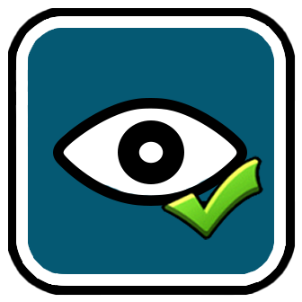

# EyeStrainHelper
A Geometry Dash mod that helps prevent eye strain without interrupting your attempts.



## Build instructions
For more info, see [the geode docs](https://docs.geode-sdk.org/getting-started/create-mod#build)
```sh
# Assuming you have the Geode CLI set up already
geode build
```